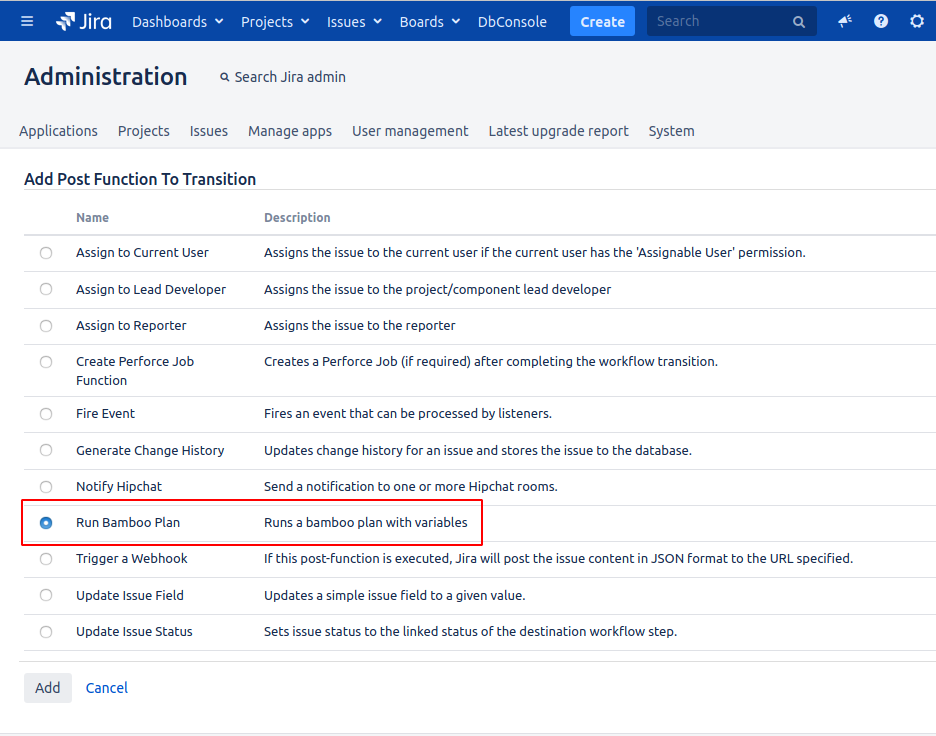
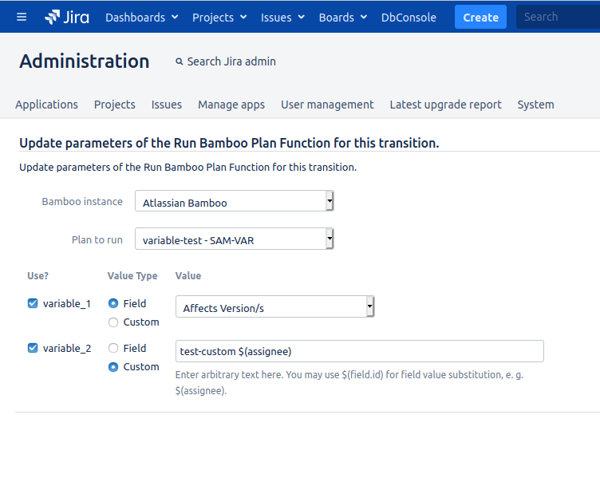
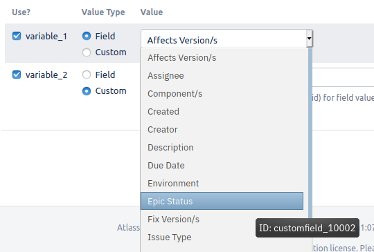

# Bamboo Plan Runner

An Atlassian JIRA workflow postfunction to run an Atlassian Bamboo Plan. It is possible to set variables for the plan to run.

## Installation

Either install it from the [Atlassian Marketplace](TODO: add link here), download a [release](TODO: add link here) and install it via the [JIRA plugin manager](https://confluence.atlassian.com/upm/installing-marketplace-apps-273875715.html#InstallingMarketplaceapps-Installingbyfileupload) or if you don't trust my builds [build it for yourself](CONTRIBUTING.md#building-a-deployment-package).

## Prerequisites

The plugin uses [Atlassian Application Links](https://confluence.atlassian.com/applinks/link-atlassian-applications-to-work-together-785449117.html) to trigger the configured plan on the Bamboo site. So once installed, ensure the following prerequisites are met before using the plugin:

- Create an [_OAuth_ application link](https://confluence.atlassian.com/bamboo/linking-to-another-application-360677713.html#Linkingtoanotherapplication-Impersonatingandnon-impersonatingauthenticationtypes) for each Atlassian Bamboo instance you want to trigger plan builds on
  - If you don't use the same user store for both JIRA and Bamboo sites, you will need to specify _OAuth (impersonating)_ for the Application Link and manually create all triggering JIRA users on the Bamboo site
- Ensure all users that might trigger the workflow transition have _Build access_ to the plan being triggered

## Configuration

Ensure the [prerequisites](#prerequisites) are met. Then:

- Add the _Run bamboo plan_ postfunction to your workflow transition
  
  

- Select the Bamboo instance and the plan to trigger
- You have two options to set values for variables of the plan
  - **Field:** Select a JIRA issue field from which the value should be taken
  - **Custom:** Enter custom text and optionally use `$(field-id)` to substitute a JIRA issue field value inside the text

    

    - Don't know the ID of a field? The selection list has the ID as a tooltip for each field

      

## Contributing

Found a bug, have a feature request or just want to get involved? See [CONTRIBUTING](CONTRIBUTING.md).